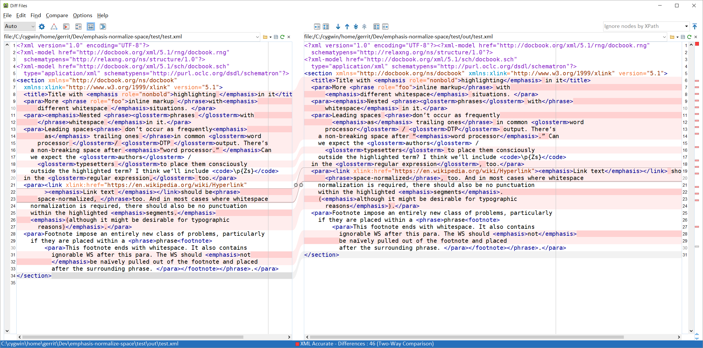
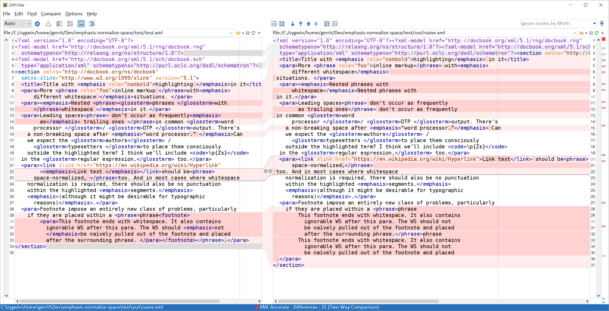

# emphasis-normalize-space
Pull leading or trailing whitespace out of phrasing elements.

Usage scenario: In word processing or DTP apps, character styles are often used to mark up keywords and other phrases of semantic relevance. Mostly for typographic reasons, these apps often include the space character that follows the keyword in the styled content. Example: `<para>A <phrase role="kwd">keyword </phrase>in a paragraph.</para>`. In high-level XML content that has been converted from these formats, these keywords typically should not contain the trailing whitespace; it needs to be extracted from the styled content and inserted again after it.

## Invocation:

### DocBook

To convert the sample file, you can call

```
saxon -xsl:test/test.xsl -s:test/test.xml -o:out.xml
```

where `saxon` is your front-end script for Saxon. 

### Parameters

If you want to retain the pulled-out spaces as styleable elements:

```
saxon -xsl:test/test.xsl -s:test/test.xml -o:out.xml {http://www.le-tex.de/namespace/emphasis-normalize-space}typographical-wrap=true
```

The default values for the parameters `ens:left-space-regex` and `ens:right-space-regex` include non-breaking, em, en, and other spaces, opening or closing brackets/quotes, and other punctuation. You can either redeclare them or, if you just want plain `\s+`-based normalization, set the parameter `ens:ws-only` to `true`.

```
saxon -xsl:test/test.xsl -s:test/test.xml -o:out.xml {http://www.le-tex.de/namespace/emphasis-normalize-space}ws-only=true
```

Instead of calling [test/test.xsl](test/test.xsl), you can also call [lib/emphasis-normalize-space.xsl](lib/emphasis-normalize-space.xsl) directly. But then you have to specify the initial mode, `ens:default`, using the curly-brace namespace URI notation. See below for examples.

### Canonical URI / XML catalogs

If you are using XML catalogs, you can include this repo’s [xmlcatalog/catalog.xml](xmlcatalog/catalog.xml) by virtue of a `nextCatalog` instruction. Then you will be able to import stuff using URIs like `http://www.le-tex.de/resource/emphasis-normalize-space/lib/emphasis-normalize-space.xsl` that do not depend on actual file locations. If a stylesheet (or another resource) is imported/included more than once, it is easier to change the `nextcatalog/@catalog` location in your project than to change each and every occasion where these resources are imported.

### Customization

There are currently front ends for TEI and JATS/BITS/STS.

```
saxon -xsl:lib/front-end-for-jats.xsl -s:test/test_jats.xml -im:{http://www.le-tex.de/namespace/emphasis-normalize-space}default
```

```
saxon -xsl:lib/front-end-for-tei.xsl -s:test/test_tei.xml -im:{http://www.le-tex.de/namespace/emphasis-normalize-space}default
```

The front ends contain more or less arbitrary assumptions for `$ens:inline-element-names` and `$ens:scope-establishing-elements`.

## Compatibility

It has been tested with Saxon HE 9.5.1.2, PE 9.6.0.7, and HE 9.7.0.8.

## Effect

When converting the DocBook example with the rich regexes (that contain punctuation and other space characters) and without typographic wrapper generation, the diff between [original](test/test.xml) and [result](test/out/test.xml) looks like this:



## Design considerations

This library can serve as an example for using `xsl:next-match` with tunneled parameters.

Also the [“same scope” function](https://github.com/gimsieke/emphasis-normalize-space/blob/f0c0d6071dd157fb2fbe96e432daa758e546f45f/lib/emphasis-normalize-space.xsl#L217) is interesting for other situations where you only want to select a paragraph’s text content and not index terms or paragraphs in footnotes or embedded lists.

Care has been taken to maintain some degree of customizability. One thing that may not be customized easily is the mode that the transformation runs in. If it needs to run in another mode, you probably have to alter the mode attributes manually in your fork.

### Naïve approach

In a first approximation, one could use the following template:

```
<xsl:template match="*[local-name() = ('emphasis', 'link', 'phrase')]
                        [matches(., '\s$')]">
    <xsl:copy>
      <xsl:apply-templates select="@*"/>
      <xsl:value-of select="replace(., '\s+$', '')"/>
    </xsl:copy>
    <xsl:value-of select="replace(., '.+?(\s+)$', '$1')"/>
  </xsl:template>
```

The result of applying [this ](lib/naive.xsl) to the input is shown here:



Please note that this solution does not aim at extracting characters other than whitespace, as was seen in the screenshot above.

## Issues and solutions

There are several other issues with the naïve approach:

* Only right-side space normalization is performed. When you also consider left-side normalization, you either need two XSLT passes or you have to test for the case where a text node needs to be processed on [both ends](https://github.com/gimsieke/emphasis-normalize-space/blob/f0c0d6071dd157fb2fbe96e432daa758e546f45f/lib/emphasis-normalize-space.xsl#L154).
* Instead of trailing whitespace only, some of the non-whitespace element content is repeated outside of the element (example: `Nested phrases with  in it.`. This can be fixed by adding the `'s'` flag to `replace()` so that line breaks count as regular white space.
* Only the outermost elements are preserved. Nested elements will be replaced with their text content. This can be fixed by ordinary (yet recursive, mind you) [matching template](https://github.com/gimsieke/emphasis-normalize-space/blob/f0c0d6071dd157fb2fbe96e432daa758e546f45f/lib/emphasis-normalize-space.xsl#L63) processing in which the left/right text nodes that need to be processed are passed as [tunneled parameters](https://github.com/gimsieke/emphasis-normalize-space/blob/f0c0d6071dd157fb2fbe96e432daa758e546f45f/lib/emphasis-normalize-space.xsl#L80) until we finally reach the [text nodes](https://github.com/gimsieke/emphasis-normalize-space/blob/f0c0d6071dd157fb2fbe96e432daa758e546f45f/lib/emphasis-normalize-space.xsl#L144) and check which ones need processing.  
When re-inserting the extracted whitespace/punctuation strings, care has to be taken not to insert them multiple times, but [only before/after the topmost element](https://github.com/gimsieke/emphasis-normalize-space/blob/f0c0d6071dd157fb2fbe96e432daa758e546f45f/lib/emphasis-normalize-space.xsl#L102) that contains them as leading/trailing whitespace/punctuation.
* If you want to extend the mechanism to punctuation, you need to use different regexes for left-hand and right-hand characters. (Although I didn’t test yet how well it deals with ambiguous characters such as [U+201C](http://www.fileformat.info/info/unicode/char/201c/index.htm). Maybe we need to assemble the character classes after reading the document language.
* A very subtle one: Footnotes that end in whitespace, or worse, in punctuation. If these footnotes are wrapped in a phrase (this may occur when the footnote marker has a character style in InDesign), it might happen that the footnote punctuation will be pulled out of the footnote. We use the [same-scope()](https://github.com/gimsieke/emphasis-normalize-space/blob/f0c0d6071dd157fb2fbe96e432daa758e546f45f/lib/emphasis-normalize-space.xsl#L217) (that deserves to be discussed in its own article) to only process text nodes within the current paragraph, not within paragraphs that are embedded because of a list item, a table cell, a figure caption, or a footnote are included in the current paragraph.


